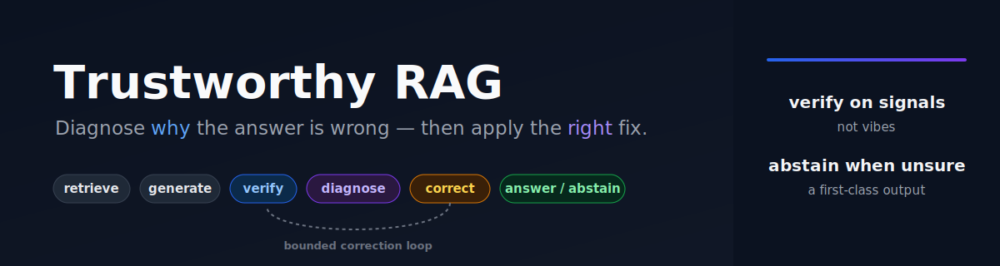
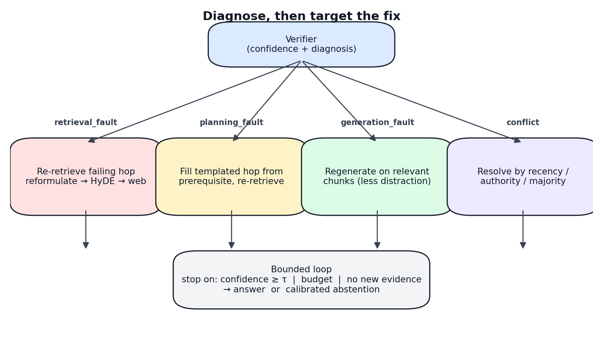
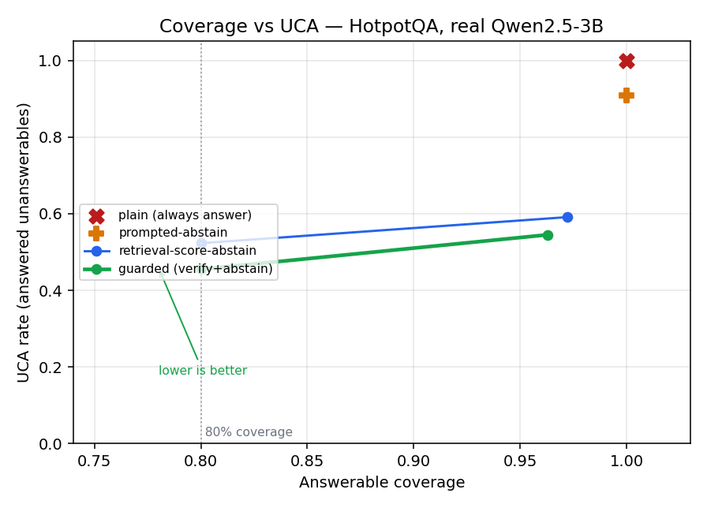

<p align="center">
  
</p>

# Trustworthy RAG

*A diagnosis-driven self-correcting RAG architecture, evaluated for trustworthiness.*

> **Trustworthy RAG.** It grounds every answer with citations, verifies it
> against the retrieved evidence, and **abstains instead of giving an unsupported
> confident answer** — with an optional diagnose-and-correct loop. On HotpotQA
> with a real 3B model it **cuts the unsupported-confident-answer rate from 100%
> (always-answer) and 91% (a prompted "say I don't know" baseline) to 55%**, at
> 96% answerable coverage and 3× better calibration. Bring your own documents and
> LLM; it's three lines to try.

[](https://github.com/MohammadNasrallahBlank/Trustworthy-RAG/actions/workflows/ci.yml)
[](LICENSE)
[](pyproject.toml)
[](tests/)
[](https://doi.org/10.5281/zenodo.21047155)

**Runnable fully offline** on deterministic fallbacks (no model weights or
network needed) — swap in real open models with one flag.



## Quickstart — use it on your own data

```python
from srag import SelfCorrectingRAG

docs = [
    "Ran is a 1985 film directed by Akira Kurosawa.",
    "Akira Kurosawa was a Japanese filmmaker born in Tokyo in 1910.",
    # ... your documents (plain strings, or {"text", "id", "source"} dicts)
]

rag = SelfCorrectingRAG.from_documents(docs)          # trustworthy mode (default): verify + abstain
print(rag.ask("Who directed Ran?").message)
#  -> "Akira Kurosawa [doc0::c0]"   (grounded answer with a citation)
print(rag.ask("Who won the 2050 World Cup?").message)
#  -> "I couldn't find reliable evidence to answer this. ..."   (abstains, no hallucination)

# Opt into the diagnose-and-correct loop for multi-hop recovery:
rag = SelfCorrectingRAG.from_documents(docs, mode="self_correcting")
print(rag.ask("What nationality is the director of Ran?").message)
#  -> "Japanese ..."   (resolves the bridge via a targeted correction)
```

Bring your own model (any `chat(prompt)->str` callable — OpenAI, vLLM, a local
Transformers model) and real encoders for production:

```python
from srag import SelfCorrectingRAG, TransformersChat
rag = SelfCorrectingRAG.from_documents(
    docs, llm=TransformersChat("Qwen/Qwen2.5-3B-Instruct"), real_models=True)
rag.calibrate([{"question": "...", "answerable": True}, ...])   # tune when to abstain
```

Full example: [`examples/quickstart.py`](examples/quickstart.py). Watch it
self-correct step by step: [`examples/show_self_correction.py`](examples/show_self_correction.py).

### What you get back

`rag.ask(q)` returns an `Answer` with `.answer`, `.status` (answered / hedged /
abstained), `.message`, `.citations`, `.corrections`, `.diagnoses`, and the full
decision `.trace` (render it with `.trace_html()` / `.trace_markdown()`).

**Stage 1 — strong static pipeline** (the baseline the loop must beat):

```
chunk → hybrid retrieve (BM25 + dense, RRF) → cross-encoder rerank → grounded
generation (claim-level citations, extract-first schema)
```

**Stage 2 — verifier** (standalone scorers): Checks 1–5 plus an
aggregator that emits a confidence scalar and a structured *diagnosis*
(`pass | retrieval_fault | generation_fault | planning_fault | conflict`) — never
a bare "sufficient/insufficient".

| Check | What it scores | Cost |
|-------|----------------|------|
| 1 retrieval-quality | reranker score level + margin (CRAG-style degree) | cheap |
| 2 claim attribution | per-claim NLI entailment vs. the cited chunk | medium |
| 3 self-consistency | agreement across sampled answers (optional) | medium |
| 4 sub-question coverage | every planned hop has a supporting passage | cheap |
| 5 conflict detection | two high-score chunks contradict each other | medium |

**Stage 3 — planner**: multi-hop query decomposition that tags
the question type (bridge / comparison / yes-no / single-hop) and emits
complementary, entity-explicit sub-queries. A bridge hop whose phrasing depends
on an earlier hop's answer is carried as an unfilled `template` + `depends_on`,
and `resolved=False` until the controller fills it. The planner **never answers**
the question. Plug it in via `Stage1Pipeline(planner=Planner())`; with no planner
the pipeline stays the Stage-1 single-hop baseline (the bar to beat in the eval
curve).

**Stage 4 — controller**: the diagnosis→action router and
the bounded control loop. Each verifier diagnosis routes to a *targeted*
correction — fill the templated bridge hop from its prerequisite's answer then
re-retrieve it (`planning_fault`), escalating re-retrieval reformulate→HyDE→web
(`retrieval_fault`), reduced-evidence regenerate (`generation_fault`), or
conflict-resolution by recency/authority (`conflict`). The loop stops on **any**
of confidence ≥ τ, budget exhausted, or no-new-evidence (a retrieval pass that
surfaces only already-seen chunks, once the escalation ladder is spent).
`seen_chunk_ids` dedups across passes and evidence accumulates, so corrections
stay surgical.

**Stage 5 — abstention + calibration**: abstention is a
first-class output. The finalizer maps the verifier's confidence to one of three
outcomes — **answered** (≥ τ_answer: the answer + citations), **hedged**
(τ_abstain ≤ conf < τ_answer: best partial + an explicit list of what couldn't be
verified), or **abstained** (< τ_abstain: "I couldn't find reliable evidence" +
what's missing). `calibrate_thresholds` fits τ_answer / τ_abstain on a dev set
with a known-unanswerable subset and reports abstention precision/recall, not
just answer accuracy.

**Stage 6 — evaluation harness**: honest evaluation as part of
the architecture. Metrics are reported *separately* — SQuAD-style EM/F1,
claim-level faithfulness, retrieval recall@k/MRR, abstention precision/recall,
and cost (operations + honest wall-clock latency, no artificial sleeps) — each
with a seeded bootstrap CI. The **primary result** is the trustworthiness
evaluation — Unsupported Confident Answer rate vs. coverage against four
shared-component baselines (see [Results](#results--trustworthiness-hotpotqa-real-3b)).
The harness also produces an accuracy-vs-cost curve across
`naive → reranker_baseline → +planning → full → ablations` with a paired bootstrap
significance test; where the loop can't beat the baseline, that's reported as a
(legitimate) negative result rather than hidden. Real datasets plug in via
`load_hotpot_style` (HotpotQA / 2WikiMultiHopQA / MuSiQue).

## Install

```bash
pip install -e .            # core (numpy only) — runs fully offline
pip install -e ".[models]"  # + sentence-transformers / transformers / torch
pip install -e ".[dev]"     # + pytest
```

## Run

```bash
python examples/run_demo.py     # full controller loop over the sample corpus
python examples/run_trust.py --dataset docs --backend offline  # trust eval (UCA/abstention)
python -m pytest -q             # 149 tests, all offline
python examples/run_eval.py     # accuracy-vs-cost curve -> eval_report.md
python examples/run_hotpot.py   # HotpotQA distractor-setting eval (bundled sample)
python examples/run_real_models.py  # full loop on real open models (needs weights)
```

## Model backends (open / local)

Each model component has a real open-model path and a dependency-light offline
fallback, chosen automatically:

| Component | Primary (open model) | Offline fallback |
|-----------|----------------------|------------------|
| Dense embeddings | `sentence-transformers` bi-encoder | TF-IDF vectorizer |
| Reranker | `sentence-transformers` CrossEncoder | IDF-weighted token overlap |
| Generator | pluggable local LLM (returns the JSON schema) | deterministic extractive |
| Entailment (Check 2) | `sentence-transformers` CrossEncoder NLI | lexical containment + polarity |
| Planner | pluggable LLM (returns `{type, sub_queries}` JSON) | rule-based decomposer |
| Sparse | built-in pure-Python BM25 | (same) |

Install `sentence-transformers` and the pipeline auto-upgrades to real models
when their weights are reachable — no code change. `pipeline.backends` reports
which path is live. The fallbacks exist so the pipeline runs and tests pass on
an air-gapped box; they are not production substitutes for a real encoder. The
rule-based planner is conservative — it only decomposes the bridge/comparison
shapes it recognizes and otherwise returns a single hop; a capable LLM planner
is recommended for general multi-hop.

## Layout

```
srag/
  state.py       typed state (Chunk, SubQuery, Claim, GenerationResult, RAGState)
  chunking.py    section/paragraph-aware chunking with overlap + metadata
  embeddings.py  dense embedder (sentence-transformers | TF-IDF fallback)
  retrieval.py   hybrid BM25 + dense retriever, RRF fusion
  reranker.py    cross-encoder reranker + score_report (first verification signal)
  generator.py   grounded, extract-first generator with claim-level citations
  planner.py     multi-hop query decomposition (bridge/comparison/yes-no)
  gate.py        active-retrieval gate (FLARE-style, stage 6b, optional)
  llm.py         real open-model adapters (transformers generator/planner)
  pipeline.py    Stage1Pipeline wiring it all together, with a decision trace
  entailment.py  NLI/entailment backend (CrossEncoder NLI | lexical fallback)
  verifier.py    Verifier: Checks 1-5 + confidence/diagnosis aggregator
  controller.py  Controller: diagnosis->action router + bounded control loop
  finalizer.py   Finalizer: answered / hedged / abstained (calibrated)
  calibration.py threshold fitting on a dev set with unanswerables
  evaluation/    metrics, datasets, configs, harness, report (stage 6),
                 trust, leakage, curves, artifact (trustworthy-RAG eval)
data/            sample_corpus.jsonl, dev_set.jsonl, eval_set.jsonl, hotpot_sample.json
examples/        run_trust.py, run_demo.py, run_eval.py, run_hotpot.py, run_real_models.py
tests/           test_pipeline / verifier / planner / controller /
                 finalizer / calibration / evaluation
```

## The bridge-question result (why stage 3 matters)

On *"What nationality is the director of Ran?"* against the sample corpus:

| Config | type | hops | outcome |
|--------|------|------|---------|
| baseline (no planner) | single-hop | 1 | `pass` — blind, answer wrong |
| `+planning` (stage 3) | bridge | 2 | `planning_fault` on `hop_1` (diagnosed, not fixed) |
| `+controller` (stage 4) | bridge | 2 | **answer `"Japanese"`** after 1 `fill-and-retrieve` correction |

With one hop the coverage check (4) sees full coverage and the extracted claims
*are* entailed, so Stage 1 waves a wrong answer through. Stage 3's planner
exposes the nationality hop and coverage flags it as a `planning_fault`. Stage
4's controller then fills the templated hop from hop 0's answer (`Akira
Kurosawa`), re-retrieves, and re-synthesizes the terminal hop to `"Japanese"` —
the surgical correction from the doc's worked example (section 6).

On the dev set (`data/dev_set.jsonl`), calibration is what stops a confident
wrong answer: *"Who won the 2050 World Cup?"* scores 0.65 from the lexical stack
— above the default τ=0.55, so the system would answer it — but calibration
raises τ to 0.68 and the question correctly abstains (abstention precision/recall
= 1.0 on the dev set).

## Mechanism check (tiny bundled set)

> The headline trust numbers are in **[Results](#results--trustworthiness-hotpotqa-real-3b)**
> above. This smaller demo just shows the *mechanism* on the bundled corpus.

`python examples/run_eval.py` writes `eval_report.md`. On the bundled set
(6 answerable + 4 unanswerable), the full loop lifts answer F1 to 0.71 vs 0.54 for
the reranked baseline and reaches abstention precision/recall 1.00/1.00, at higher
cost (≈5.3 vs 3.0 operations) — but with only 6 answerable questions that F1 gain
is **not significant** (one-sided p ≈ 0.33), and the report says so. It is a
mechanism illustration, not a result.

## Real open models

Every model component swaps to a real open model with no code change to the core:

```python
from srag import Embedder, CrossEncoderReranker, EntailmentModel, GroundedGenerator, Planner
from srag import TransformersChat, make_llm_generator_fn, make_llm_planner_fn

emb = Embedder(prefer_fallback=False)            # sentence-transformers bi-encoder
rr  = CrossEncoderReranker(prefer_fallback=False) # cross-encoder reranker
chat = TransformersChat("Qwen/Qwen2.5-1.5B-Instruct")
gen = GroundedGenerator(llm=make_llm_generator_fn(chat))   # LLM, JSON schema
plan = Planner(llm=make_llm_planner_fn(chat))              # LLM decomposition
```

The embedder/reranker auto-upgrade when weights are reachable; `srag/llm.py`
supplies the concrete LLM generator/planner adapters (lazy `transformers`,
tested offline against a fake chat). See `examples/run_real_models.py`.

## HotpotQA (distractor setting)

`srag.evaluation.load_hotpot_distractor` reads HotpotQA / 2Wiki-format records,
builds the corpus from each question's context (gold + distractor paragraphs —
no leakage), maps `supporting_facts` to gold chunk ids, and feeds the harness.
`examples/run_hotpot.py` runs it on a bundled 4-record sample and on the full
dev set locally (`python examples/run_hotpot.py hotpot_dev_distractor_v1.json`).
On the sample, retrieval metrics are real (recall@k ≈ 0.88, MRR ≈ 0.88) and the
full loop doubles EM over the reranked baseline (0.50 vs 0.25) — illustrative on
4 questions, but it exercises the genuine distractor-setting pipeline.

## Active-retrieval gate (stage 6b, optional)

`Stage1Pipeline(gate=RetrievalGate())` adds the doc's §4.1 efficiency gate: a
cheap classifier skips retrieval for parametric/stable queries (arithmetic,
chit-chat) and retrieves for time-sensitive or entity-heavy ones, plus a
FLARE-style `flare_spans` that selects low-confidence factual spans for active
retrieval during generation. It is off by default (an optimization, not a
correctness requirement).

## Results — trustworthiness (HotpotQA, real 3B)

The point of the system is **fewer unsupported confident answers (UCA) at
preserved coverage**, so it is measured against four baselines sharing the same
retriever, reranker, and LLM. On HotpotQA (distractor setting, Qwen2.5-3B, 152
test questions, 44 leakage-checked unanswerables, thresholds frozen on a dev
split):

| system | coverage | UCA ↓ | UCA @0.8 cov ↓ | selective risk ↓ | trustworthy ↑ | AUROC ↑ | ECE ↓ |
|---|---|---|---|---|---|---|---|
| plain (always answer) | 1.000 | 1.000 | 1.000 | 0.565 | 0.309 | 0.50 | 0.309 |
| prompted-abstain (one-line prompt) | 1.000 | 0.909 | 0.909 | 0.593 | 0.316 | 0.50 | 0.289 |
| retrieval-score-abstain | 0.972 | 0.591 | 0.523 | 0.571 | 0.434 | 0.617 | 0.549 |
| **guarded** (verify + abstain) | 0.963 | **0.545** | **0.455** | 0.567 | **0.454** | 0.609 | **0.106** |
| guarded+correct (adds loop) | 0.963 | 0.545 | 0.455 | 0.567 | 0.454 | 0.609 | 0.106 |

`guarded` answers only 24 of the 44 unanswerable questions (vs 44 and 40 for the
baselines) — significant against both (McNemar p≈10⁻⁶ vs plain, p≈0.014 vs
prompted-abstain) — while keeping 96% coverage and falsely refusing just 3.7% of
answerable questions, with 3× better calibration (ECE 0.31 → 0.11).



**Reported honestly:** the correction loop adds **nothing** over `guarded` here
(identical rows) — it's off by default, opt-in via `mode="self_correcting"`. And
verification does **not** lower selective risk: it abstains on unanswerables, it
does not make the answers it gives more accurate. Regenerate everything with:

```bash
python examples/run_trust.py --dataset hotpotqa --backend real \
    --model "Qwen/Qwen2.5-3B-Instruct" --n 300 --unanswerable-frac 0.4 --seed 0
```

## Known limitations

- **Abstention trades off with coverage** — you choose the operating point; the
  curve above is the honest full picture.
- **The verifier can be wrong** (AUROC ≈ 0.61) — it catches missing evidence far
  better than wrong-but-evidenced answers, so selective risk is flat.
- **UCA is corpus-grounded, not factual hallucination** — an answer unsupported by
  *your corpus* may still be true from pretraining.
- **The correction loop costs more for no trust benefit on this benchmark** — opt-in.
- **One dataset, one 3B model, 152 test questions** — directional, not the last word.
- **No truth guarantee** — it improves evidence discipline, not absolute correctness.

## Reproducing

The trust result above is regenerated by `examples/run_trust.py` — it builds the
leakage-checked unanswerable set, calibrates abstention on a dev split (frozen for
test), runs all five systems with real open models, and writes the metrics, the
coverage/UCA curve, a per-system reproducibility artifact, and a failure analysis.
Offline smoke needs no GPU or weights.

```bash
python examples/run_trust.py --dataset docs --backend offline            # smoke (no GPU)
python examples/run_trust.py --dataset hotpotqa --backend real \
    --model "Qwen/Qwen2.5-3B-Instruct" --n 300 --unanswerable-frac 0.4 --seed 0
```

## Status

I implemented all six roadmap stages plus the optional active-retrieval gate,
real-model adapters, and a trustworthy-RAG evaluation harness, with 149 offline tests. The
full path runs end to end: plan → hybrid retrieve → rerank → grounded generate →
multi-signal verify → diagnose → targeted correct (bounded loop) → answer or
calibrated abstention — with every model component swappable for a real open
model by passing `prefer_fallback=False`. 149 offline tests.

## Author

Designed and built by **Mohamad Nasrallah**. The architecture, the design decisions, the
evaluation methodology, and the framing of this project are my own. I built the
reference implementation test-first, with
AI coding assistance working under my direction and review.

## Citation

The paper is archived on Zenodo: **DOI [10.5281/zenodo.21047155](https://doi.org/10.5281/zenodo.21047155)**.

```bibtex
@misc{nasrallah_trustworthy_rag_2026,
  author       = {Mohamad Nasrallah},
  title        = {Trustworthy RAG: Reducing Unsupported Confident Answers with Verification and Calibrated Abstention},
  year         = {2026},
  publisher    = {Zenodo},
  doi          = {10.5281/zenodo.21047155},
  url          = {https://doi.org/10.5281/zenodo.21047155}
}
```

See also [`CITATION.cff`](CITATION.cff) and the code at
<https://github.com/MohammadNasrallahBlank/Trustworthy-RAG>.

## Contributing

Issues and PRs welcome. The test suite is fully offline (`python -m pytest`);
please keep it green and add a test for any new behavior.

## License

[MIT](LICENSE) © 2026 Mohamad Nasrallah.
